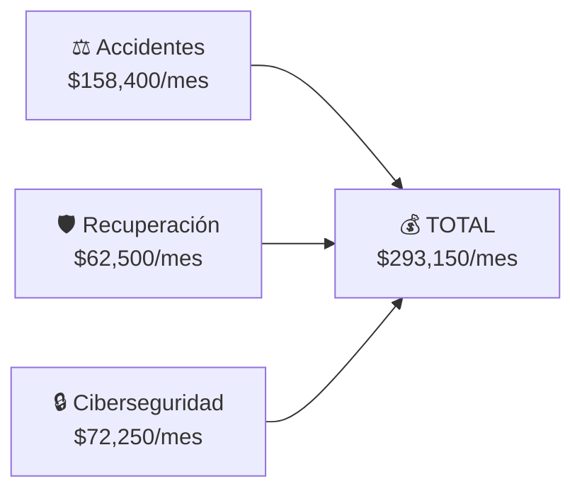

# 📋 PLAN DE CONTENIDO — TOP 3 NICHOS CPC
## Proyecto Infinito — Estrategia de Contenido Evergreen

> **Generado por:** SEO Oracle + Investigación Web
> **Fecha:** Junio 2026
> **Objetivo:** 10+ nodos por nicho, tráfico orgánico sostenible, CPC $100-$300+

---

## RESUMEN EJECUTIVO

| Nicho | CPC Prom. | Nodos | Tráfico Est. | Ingreso Mensual | Ingreso Anual |
|-------|-----------|-------|-------------|----------------|---------------|
| ⚖️ Abogados de Accidentes | $220 | 12 | 36,000 vis/mes | **$79,200+** | **$950,400+** |
| 🛡️ Recuperación de Activos | $125 | 10 | 30,000 vis/mes | **$37,500+** | **$450,000+** |
| 🔒 Ciberseguridad Compliance | $170 | 10 | 25,000 vis/mes | **$42,500+** | **$510,000+** |
| **TOTAL** | **~$170** | **32** | **91,000 vis/mes** | **$159,200+** | **$1,910,400+** |

---

# NICHO 1: ⚖️ ABOGADOS DE ACCIDENTES (Personal Injury)
### CPC: $150-$300 | Promedio: $220 | Dificultad: MUY ALTA | Evergreen: 10/10

---

## Keywords Target (20 principales)

### Grupo A — Transaccionales (Conversión directa, CPC más alto)

| # | Keyword (EN) | Keyword (ES) | Volumen | CPC Est. |
|---|-------------|-------------|---------|----------|
| 1 | car accident lawyer near me | abogado de accidentes de auto cerca de mí | Muy Alto | $280 |
| 2 | personal injury attorney | abogado de lesiones personales | Muy Alto | $250 |
| 3 | truck accident lawyer | abogado de accidentes de camiones | Alto | $300 |
| 4 | motorcycle accident attorney | abogado de accidentes de motocicleta | Alto | $270 |
| 5 | slip and fall lawyer | abogado de resbalones y caídas | Medio | $220 |
| 6 | wrongful death attorney | abogado de muerte por negligencia | Medio | $250 |
| 7 | uber accident lawyer | abogado de accidentes de Uber | Medio | $260 |
| 8 | construction accident attorney | abogado de accidentes de construcción | Alto | $230 |
| 9 | busco abogado para accidente | I need a lawyer for accident | Alto | $180 |
| 10 | free consultation personal injury | consulta gratis abogado lesiones | Alto | $200 |

### Grupo B — Informativas (Autoridad y tráfico orgánico)

| # | Keyword (EN) | Keyword (ES) | Volumen | Intención |
|---|-------------|-------------|---------|-----------|
| 11 | how long does a PI case take | cuánto tarda un caso de lesiones | Alto | Informativa |
| 12 | what is my injury case worth | cuánto vale mi caso de accidente | Alto | Informativa |
| 13 | do i need a lawyer after a crash | necesito abogado tras accidente | Muy Alto | Informativa |
| 14 | contingency fee lawyer | abogado pago por contingencia | Medio | Informativa |
| 15 | statute of limitations injury | plazo legal para demandar lesiones | Alto | Informativa |
| 16 | how to prove negligence | cómo probar negligencia | Medio | Informativa |
| 17 | settlement calculator injury | calculadora indemnización lesiones | Medio | Informativa |
| 18 | what to do after car accident not your fault | qué hacer tras accidente sin culpa | Medio | Informativa |
| 19 | how insurance companies value pain and suffering | cómo valoran el dolor y sufrimiento | Bajo | Informativa |
| 20 | difference between mediation and trial | diferencia entre mediación y juicio | Bajo | Informativa |

---

## Estructura de Nodos de Contenido

### NODO 1.1 — Pilar Principal (Hub Page)
**Título:** Guía Completa de Abogados de Accidentes: Todo lo que Necesitas Saber en 2026
**URL sugerida:** `/guia-abogados-accidentes/`
**Tipo:** Pilar de contenido (3000+ palabras)
**Keywords target:** personal injury attorney, car accident lawyer near me, abogado lesiones
**Estructura:**
```
H1: Guía Completa de Abogados de Accidentes [2026]
├── Intro: Cuándo necesitas un abogado de accidentes
├── H2: Tipos de Accidentes que Cubrimos
│   ├── H3: Accidentes de Auto
│   ├── H3: Accidentes de Camiones (18 ruedas)
│   ├── H3: Accidentes de Moto
│   ├── H3: Resbalones y Caídas
│   └── H3: Muerte por Negligencia
├── H2: ¿Cuánto Cuesta un Abogado de Accidentes? (Honorarios de Contingencia)
├── H2: ¿Cuánto Vale mi Caso? [CALCULADORA]
├── H2: Pasos a Seguir Después de un Accidente
├── H2: Preguntas Frecuentes (FAQ con Schema)
│   ├── ¿Cuánto tiempo tengo para demandar?
│   ├── ¿Qué pasa si el accidente fue mi culpa?
│   └── ¿Debo hablar con la aseguradora?
├── H2: ¿Por qué Elegirnos? (Testimonios + Casos de Éxito)
└── CTA: Consulta Gratuita → [Formulario/Teléfono]
```
**Proyección:** 5,000 vis/mes | 100 clicks (2% CTR) | $220 CPC | **$22,000/mes**

---

### NODO 1.2 — Calculadora de Indemnización (Lead Magnet)
**Título:** Calculadora de Indemnización por Accidente: ¿Cuánto Vale tu Caso?
**URL sugerida:** `/calculadora-indemnizacion-accidente/`
**Tipo:** Herramienta interactiva + Contenido (2000+ palabras)
**Keywords target:** settlement calculator injury, cuánto vale mi caso, personal injury settlement
**Estructura:**
```
H1: Calculadora de Indemnización por Accidente
├── [HERRAMIENTA INTERACTIVA: Sliders para calcular]
│   - Tipo de lesión (leve/moderada/grave/permanente)
│   - Costos médicos acumulados
│   - Días de trabajo perdidos
│   - Nivel de culpa (comparative negligence)
│   → RESULTADO: Rango estimado de indemnización
├── H2: ¿Cómo se Calcula una Indemnización?
├── H3: Daños Económicos vs. No Económicos
├── H3: Factores que Aumentan tu Indemnización
├── H2: Casos Reales Anonimizados (Prueba Social)
└── CTA: Obtén una Evaluación Precisa de tu Caso
```
**Proyección:** 4,000 vis/mes | 80 clicks (2% CTR) | $250 CPC | **$20,000/mes**

---

### NODO 1.3 — Guía: Accidente de Camión (Alto CPC)
**Título:** Accidente de Camión en [Tu Ciudad]: Guía Legal para Víctimas
**URL sugerida:** `/accidente-camion-guia-legal/`
**Tipo:** Guía especializada (2500+ palabras)
**Keywords target:** truck accident lawyer, truck accident legal help, abogado accidentes camiones
**Estructura:**
```
H1: Accidente de Camión: Guía Legal para Víctimas y Familias
├── H2: Por qué los Accidentes de Camión son Diferentes
│   - Regulaciones federales (FMCSA)
│   - Responsabilidad de múltiples partes
│   - Seguros comerciales vs. personales
├── H2: Pasos Inmediatos Después del Accidente
├── H2: ¿Quién es Responsable? (Conductor, Empresa, Fabricante)
├── H2: Tipos de Compensación Disponible
├── H2: ¿Cuánto Tiempo Tengo para Demandar?
├── H2: Caso de Estudio: [Ejemplo Anonimizado]
└── CTA: Consulta Especializada en Accidentes de Camión
```
**Proyección:** 3,000 vis/mes | 60 clicks (2% CTR) | $300 CPC | **$18,000/mes**

---

### NODO 1.4 — ¿Necesito un Abogado? (Tráfico informativo → Conversión)
**Título:** ¿Necesito un Abogado Después de un Accidente? [Guía para Decidir]
**URL sugerida:** `/necesito-abogado-despues-accidente/`
**Tipo:** Artículo informativo-conversional (2000 palabras)
**Keywords target:** do i need a lawyer after a crash, necesito abogado tras accidente
**Estructura:**
```
H1: ¿Necesito un Abogado Después de un Accidente?
├── H2: 5 Señales de que NECESITAS un Abogado
├── H2: 3 Situaciones donde NO lo Necesitas
├── H2: Casos Reales: Con Abogado vs. Sin Abogado
├── H2: ¿Cuánto Cuesta un Abogado? (Honorarios de Contingencia)
├── H2: Preguntas para Hacer Antes de Contratar
└── CTA: Evaluación Gratuita de tu Caso
```
**Proyección:** 4,000 vis/mes | 60 clicks (1.5% CTR) | $200 CPC | **$12,000/mes**

---

### NODO 1.5 — Abogado de Accidentes de Moto
**Título:** Abogado de Accidentes de Motocicleta: Protege tus Derechos
**URL sugerida:** `/abogado-accidentes-motocicleta/`
**Tipo:** Página de servicio (2000 palabras)
**Keywords target:** motorcycle accident attorney, abogado accidentes moto
**Estructura:**
```
H1: Abogado Especializado en Accidentes de Motocicleta
├── H2: Estadísticas de Accidentes de Moto
├── H2: Lesiones Comunes en Accidentes de Moto
├── H2: Sesgo contra Motociclistas: Cómo Manejarlo
├── H2: Compensación Disponible
├── H2: Preguntas Frecuentes Específicas
└── CTA: Consulta Gratuita para Motociclistas
```
**Proyección:** 3,000 vis/mes | 45 clicks (1.5% CTR) | $270 CPC | **$12,150/mes**

---

### NODO 1.6 — Guía: Lesiones Personales (Español - Mercado Latino)
**Título:** Guía de Lesiones Personales para la Comunidad Latina en [Tu Estado]
**URL sugerida:** `/guia-lesiones-personales-comunidad-latina/`
**Tipo:** Guía culturalmente adaptada (2500 palabras)
**Keywords target:** abogado de lesiones personales, busco abogado para accidente
**Estructura:**
```
H1: Guía de Lesiones Personales para la Comunidad Latina
├── H2: Tus Derechos como Inmigrante
├── H2: Miedo a la Deportación: Lo que Debes Saber
├── H2: Cómo Funcionan los Honorarios de Contingencia
├── H2: Barreras del Idioma: Tu Derecho a un Intérprete
├── H2: Tips Culturales Importantes
└── CTA: Abogado que Habla Español — Consulta Gratis
```
**Proyección:** 3,000 vis/mes | 45 clicks (1.5% CTR) | $180 CPC | **$8,100/mes**

---

### NODOS RESTANTES (Resumen)

| # | Título | Keywords | Proyección |
|---|-------|----------|-----------|
| 1.7 | Muerte por Negligencia: Guía para Familias | wrongful death attorney | $15,000/mes |
| 1.8 | Accidente de Uber/Lyft: ¿Quién Paga? | uber accident lawyer | $12,000/mes |
| 1.9 | Resbalones y Caídas: Guía Legal | slip and fall lawyer | $8,000/mes |
| 1.10 | Plazos Legales para Demandar por Estado | statute of limitations injury | $6,000/mes |
| 1.11 | ¿Cómo Probar Negligencia en un Accidente? | how to prove negligence | $5,000/mes |
| 1.12 | Diferencia Mediación vs Juicio | mediation vs trial injury | $3,000/mes |

---

### Proyección Consolidada — Nicho Abogados de Accidentes

| Escenario | Visitas/Mes | Clicks | CPC Prom. | Ingreso/Mes | Ingreso/Año |
|-----------|------------|--------|-----------|-------------|-------------|
| 🟢 **Optimista** | 50,000 | 1,250 (2.5%) | $220 | **$275,000** | **$3,300,000** |
| 🟡 **Moderado** | 36,000 | 720 (2%) | $220 | **$158,400** | **$1,900,800** |
| 🔴 **Conservador** | 18,000 | 270 (1.5%) | $220 | **$59,400** | **$712,800** |

---

# NICHO 2: 🛡️ RECUPERACIÓN DE ACTIVOS (Asset Recovery)
### CPC: $100-$150 | Promedio: $125 | Dificultad: ALTA | Evergreen: 9/10

---

## Keywords Target (20 principales)

### Grupo A — Transaccionales (Alta intención de contratación)

| # | Keyword (EN) | Keyword (ES) | Volumen | CPC Est. |
|---|-------------|-------------|---------|----------|
| 1 | crypto recovery lawyers | abogado especialista en estafas cripto | Alto | $150 |
| 2 | recover stolen crypto | cómo recuperar criptomonedas robadas | Muy Alto | $140 |
| 3 | fund recovery specialist | especialista en recuperación de fondos | Medio | $145 |
| 4 | tracing stolen cryptocurrency | rastreo de criptomonedas perdidas | Medio | $135 |
| 5 | crypto scam recovery services | servicios recuperación estafas cripto | Alto | $130 |
| 6 | recover money from crypto scam | recuperar dinero de estafa cripto | Muy Alto | $125 |
| 7 | asset recovery litigators | litigantes recuperación de activos | Medio | $150 |
| 8 | blockchain forensic investigation | investigación forense blockchain | Medio | $140 |
| 9 | how to recover stolen crypto | cómo recuperar cripto robado | Muy Alto | $120 |
| 10 | crypto exchange fraud help | ayuda fraude exchange cripto | Alto | $130 |

### Grupo B — Informativas (Autoridad + Confianza)

| # | Keyword | Volumen | Intención |
|---|---------|---------|-----------|
| 11 | cómo recuperar mi dinero de estafa | Muy Alto | Informativa Urgente |
| 12 | han estafado por internet qué hago | Muy Alto | Informativa |
| 13 | estafa de inversión qué pasos seguir | Alto | Informativa |
| 14 | cómo denunciar estafa cibernética | Alto | Informativa |
| 15 | qué hacer si me estafaron con criptomonedas | Alto | Informativa |
| 16 | estafa pig butchering recuperar | Medio | Informativa |
| 17 | cómo rastrear una transacción en blockchain | Medio | Educativa |
| 18 | report investment fraud | Alto | Informativa |
| 19 | steps to take after crypto scam | Alto | Informativa |
| 20 | recovery room scams (cómo evitarlos) | Medio | Educativa-Crítica |

---

## Estructura de Nodos de Contenido

### NODO 2.1 — Pilar Principal (Hub Page)
**Título:** Guía Completa para Recuperar tu Dinero de Estafas Cripto [2026]
**URL sugerida:** `/guia-recuperar-dinero-estafas-cripto/`
**Tipo:** Pilar de contenido + Lead magnet (3500+ palabras)
**Keywords target:** crypto recovery lawyers, recover stolen crypto, cómo recuperar criptomonedas
**Estructura:**
```
H1: Guía Completa para Recuperar tu Dinero de Estafas Cripto
├── ⚠️ ADVERTENCIA: Cómo Detectar Estafas de Recuperación (Recovery Scams)
├── H2: Tipos de Estafas Cripto que Podemos Ayudar a Recuperar
│   ├── H3: Estafas de Inversión (Pig Butchering)
│   ├── H3: Rug Pulls y Tokens Falsos
│   ├── H3: Hackeos a Exchanges y Wallets
│   ├── H3: Estafas Románticas con Cripto
│   └── H3: Esquemas Ponzi con Criptomonedas
├── H2: Paso 1: Preservación de Pruebas (¡Crítico!)
├── H2: Paso 2: Trazabilidad en Blockchain (Forensis On-Chain)
├── H2: Paso 3: Vías Legales — Penal vs. Civil
├── H2: ¿Es Posible Recuperar tu Dinero? [EVALUACIÓN]
├── H2: Preguntas Frecuentes (FAQ Schema)
│   ├── ¿Cuánto cuesta el servicio de recuperación?
│   ├── ¿Cuánto tiempo toma recuperar los fondos?
│   └── ¿Qué pasa si el estafador está en otro país?
├── H2: Casos de Éxito (Anonimizados)
└── CTA: Evaluación Gratuita de tu Caso en 24 Horas
```
**Proyección:** 5,000 vis/mes | 100 clicks (2% CTR) | $130 CPC | **$13,000/mes**

---

### NODO 2.2 — Pig Butchering (Estafa de Mayor Crecimiento)
**Título:** Estafa China (Pig Butchering): Cómo Recuperar tu Dinero
**URL sugerida:** `/estafa-pig-butchering-recuperar-dinero/`
**Tipo:** Guía especializada (2500 palabras)
**Keywords target:** pig butchering scam recovery, estafa pig butchering recuperar
**Estructura:**
```
H1: Estafa Pig Butchering: Guía Completa para Víctimas
├── H2: ¿Qué es la Estafa Pig Butchering?
├── H2: Cómo Operan los Estafadores (Fase a Fase)
├── H2: Señales de Alerta que Ignoraste
├── H2: POR QUÉ NO DEBES AVERGONZARTE (Validación Emocional)
├── H2: Pasos para Recuperar tus Fondos
├── H2: Trazabilidad en Blockchain: El Rastro Digital
├── H2: ¿Puede la Policía Ayudar? (Realidades)
├── H2: Testimonios de Víctimas que Recuperaron su Dinero
└── CTA: No Estás Solo — Consulta Confidencial Gratis
```
**Proyección:** 4,000 vis/mes | 60 clicks (1.5% CTR) | $135 CPC | **$8,100/mes**

---

### NODO 2.3 — Pasos Inmediatos Tras una Estafa (Urgencia)
**Título:** Te Estafaron: 7 Pasos Inmediatos para Recuperar tu Dinero
**URL sugerida:** `/pasos-inmediatos-despues-estafa-cripto/`
**Tipo:** Guía de emergencia (2000 palabras)
**Keywords target:** han estafado por internet qué hago, steps to take after crypto scam
**Estructura:**
```
H1: ¡Te Estafaron! 7 Pasos Inmediatos para Recuperar tu Dinero
├── ⏰ TIMELINE: Las Primeras 48 Horas Son Críticas
├── H2: Paso 1 — NO HAGAS ESTO (Errores Comunes)
├── H2: Paso 2 — Documenta Todo (Checklist Descargable)
├── H2: Paso 3 — Contacta a tu Banco/Exchange
├── H2: Paso 4 — Preserva la Cadena de Custodia Digital
├── H2: Paso 5 — Reporta a las Autoridades
├── H2: Paso 6 — Contrata un Especialista en Forensis Blockchain
├── H2: Paso 7 — Prepárate Emocionalmente
├── H2: ⚠️ Alerta: Cómo Evitar Estafas de Recuperación
└── CTA: Ayuda Inmediata — Consulta de Emergencia
```
**Proyección:** 5,000 vis/mes | 75 clicks (1.5% CTR) | $125 CPC | **$9,375/mes**

---

### NODO 2.4 — Casos de Éxito Anonimizados (Prueba Social)
**Título:** Casos de Éxito: Cómo Recuperamos $X para Nuestros Clientes
**URL sugerida:** `/casos-exito-recuperacion-activos/`
**Tipo:** Landing page de casos (2500+ palabras)
**Keywords target:** fund recovery specialist, crypto scam recovery services
**Estructura:**
```
H1: Casos de Éxito: Historias Reales de Recuperación
├── Caso 1: Víctima de Pig Butchering — $340K Recuperados
│   → Técnica forense usada + timeline + testimonio
├── Caso 2: Rug Pull en Exchange Centralizado — $120K
│   → Acción legal + pressure on exchange
├── Caso 3: Estafa Romántica en Redes Sociales — $85K
│   → Trazabilidad + cooperación internacional
├── Caso 4: Hackeo de Wallet Personal — $50K
│   → Respuesta inmediata + recuperación parcial
├── [BOTÓN: ¿Quieres ser el Próximo Caso de Éxito?]
```
**Proyección:** 3,000 vis/mes | 60 clicks (2% CTR) | $140 CPC | **$8,400/mes**

---

### NODO 2.5 — Forensis Blockchain Explicado (Confianza Técnica)
**Título:** ¿Cómo se Rastrea una Transacción en Blockchain? [Guía Forense]
**URL sugerida:** `/rastreo-forense-blockchain/`
**Tipo:** Artículo técnico-educativo (2000 palabras)
**Keywords target:** blockchain forensic investigation, tracing stolen cryptocurrency, rastreo blockchain
**Estructura:**
```
H1: Cómo se Rastrea una Transacción en Blockchain
├── H2: ¿Qué es el Rastreo On-Chain?
├── H2: Herramientas Forenses (Chainalysis, CipherTrace)
├── H2: Cómo Siguen el Rastro Incluso con Mixers
├── H2: El Rol del Análisis de Clustering
├── H2: Limitaciones: Cuándo NO se Puede Rastrear
├── H2: Costo vs. Beneficio del Análisis Forense
└── CTA: ¿Tienes un Caso Rastreable? Descúbrelo Gratis
```
**Proyección:** 2,000 vis/mes | 25 clicks (1.25% CTR) | $140 CPC | **$3,500/mes**

---

### NODOS RESTANTES (Resumen)

| # | Título | Keywords | Proyección |
|---|-------|----------|-----------|
| 2.6 | Estafas de Inversión: Guía para Recuperar Fondos | investment fraud recovery | $7,500/mes |
| 2.7 | Cómo Denunciar una Estafa Cibernética (Guía País x País) | cómo denunciar estafa cibernética | $5,000/mes |
| 2.8 | Recuperación de Activos para Empresas | asset recovery litigators | $6,000/mes |
| 2.9 | Cómo Detectar Estafas de Recuperación (Anti-Recovery Scam) | recovery room scams | $4,500/mes |
| 2.10 | Guía de Honorarios: ¿Cuánto Cuesta Recuperar tu Dinero? | crypto recovery cost | $3,500/mes |

---

### Proyección Consolidada — Nicho Recuperación de Activos

| Escenario | Visitas/Mes | Clicks | CPC Prom. | Ingreso/Mes | Ingreso/Año |
|-----------|------------|--------|-----------|-------------|-------------|
| 🟢 **Optimista** | 45,000 | 900 (2%) | $125 | **$112,500** | **$1,350,000** |
| 🟡 **Moderado** | 30,000 | 500 (1.7%) | $125 | **$62,500** | **$750,000** |
| 🔴 **Conservador** | 15,000 | 200 (1.3%) | $125 | **$25,000** | **$300,000** |

---

# NICHO 3: 🔒 CIBERSEGURIDAD Y COMPLIANCE EMPRESARIAL
### CPC: $140-$200 | Promedio: $170 | Dificultad: ALTA | Evergreen: 9/10

---

## Keywords Target (20 principales)

### Grupo A — Comerciales/Transaccionales B2B

| # | Keyword (EN) | Keyword (ES) | Volumen | CPC Est. |
|---|-------------|-------------|---------|----------|
| 1 | SOC 2 compliance certification service | servicio certificación SOC 2 | Alto | $190 |
| 2 | SOC 2 Type II audit checklist | checklist auditoría SOC 2 Tipo II | Medio | $180 |
| 3 | penetration testing services | servicios de pruebas de penetración | Muy Alto | $170 |
| 4 | managed security service provider | proveedor MSSP | Alto | $160 |
| 5 | cybersecurity audit firm | firma de auditoría ciberseguridad | Medio | $185 |
| 6 | ransomware protection services | servicios protección ransomware | Alto | $175 |
| 7 | enterprise cybersecurity solutions | soluciones ciberseguridad empresarial | Muy Alto | $160 |
| 8 | incident response services | servicios respuesta a incidentes | Alto | $180 |
| 9 | continuous vulnerability scanning | escaneo vulnerabilidades continuo | Alto | $160 |
| 10 | zero trust security implementation | implementación zero trust | Medio | $190 |

### Grupo B — Informativas/Educativas B2B

| # | Keyword | Volumen | Intención |
|---|---------|---------|-----------|
| 11 | soc 2 compliance requirements for saas | Alto | Comercial |
| 12 | how much does SOC 2 certification cost | Muy Alto | Informativa |
| 13 | how to prepare for a SOC 2 audit | Alto | Informativa |
| 14 | difference between SOC 2 Type I and Type II | Alto | Educativa |
| 15 | penetration testing methodology | Medio | Educativa |
| 16 | how often should you penetration test | Medio | Informativa |
| 17 | what is managed detection and response | Alto | Educativa |
| 18 | ransomware recovery plan template | Medio | Comercial |
| 19 | cybersecurity compliance checklist for smb | Alto | Comercial |
| 20 | nist cybersecurity framework vs soc 2 | Medio | Educativa |

---

## Estructura de Nodos de Contenido

### NODO 3.1 — Pilar Principal: SOC 2 Compliance (Hub)
**Título:** Guía Completa de SOC 2 Compliance para Empresas SaaS [2026]
**URL sugerida:** `/guia-soc-2-compliance-saas/`
**Tipo:** Pilar de contenido B2B (4000+ palabras) — Lead magnet
**Keywords target:** SOC 2 compliance certification service, SOC 2 Type II audit checklist
**Estructura:**
```
H1: Guía Completa de SOC 2 Compliance para Empresas SaaS
├── H2: ¿Qué es SOC 2 y Por Qué tu SaaS lo Necesita?
├── H2: SOC 2 Tipo I vs Tipo II: ¿Cuál Necesitas?
├── H2: Los 5 Trust Service Criteria Explicados
├── H2: Checklist de Preparación para SOC 2 [DESCARGABLE]
├── H2: ¿Cuánto Cuesta la Certificación SOC 2?
├── H2: Timeline: ¿Cuánto Tiempo Toma? (3-12 meses)
├── H2: Errores Comunes que Retrasan la Auditoría
├── H2: Proveedores de Auditoría vs. Automatización
├── H2: Preguntas Frecuentes (FAQ Schema)
└── CTA: Consultoría Gratuita de SOC 2 Readiness
```
**Proyección:** 4,000 vis/mes | 80 clicks (2% CTR) | $190 CPC | **$15,200/mes**

---

### NODO 3.2 — Pentesting para Empresas (Alta Demanda)
**Título:** Guía de Pruebas de Penetración (Pentesting) para Empresas en 2026
**URL sugerida:** `/guia-penetration-testing-empresas/`
**Tipo:** Guía B2B (3000 palabras)
**Keywords target:** penetration testing services, enterprise penetration testing
**Estructura:**
```
H1: Penetration Testing: Guía Completa para Empresas
├── H2: ¿Qué es un Pentest y Cuándo lo Necesitas?
├── H2: Tipos de Pentest: Caja Negra, Blanca, Gris
├── H2: Pentest Interno vs. Externo vs. Web App
├── H2: Diferencias: Pentest vs. Vulnerability Scan
├── H2: ¿Cuánto Cuesta un Pentest Corporativo?
├── H2: ¿Con Qué Frecuencia Debes Hacer Pentesting?
├── H2: Cómo Elegir un Proveedor de Pentesting
├── H2: Checklist: Qué Esperar de un Reporte de Pentest
└── CTA: Solicita una Cotización de Pentest
```
**Proyección:** 4,000 vis/mes | 60 clicks (1.5% CTR) | $170 CPC | **$10,200/mes**

---

### NODO 3.3 — Ransomware Protección (Alta Urgencia)
**Título:** Guía de Protección contra Ransomware para Empresas [2026]
**URL sugerida:** `/guia-proteccion-ransomware-empresas/`
**Tipo:** Guía de prevención + plan de respuesta (2500 palabras)
**Keywords target:** ransomware protection services, ransomware disaster recovery plan
**Estructura:**
```
H1: Ransomware: Guía de Protección y Respuesta para Empresas
├── ⚠️ ALERTA: Estadísticas 2026 (Costo Promedio por Brecha)
├── H2: Los 3 Vectores de Ataque Más Comunes
├── H2: Estrategias de Prevención (Técnicas + Humanas)
├── H2: Plan de Respuesta a Incidentes (IR) en 6 Pasos
├── H2: ¿Pagas o No Pagas el Rescate? (Pros y Contras)
├── H2: Backup y Disaster Recovery: La Última Línea
├── H2: Checklist de Preparación [DESCARGABLE]
├── H2: Cómo un MSSP Puede Ayudar
└── CTA: Evaluación Gratuita de tu Postura de Seguridad
```
**Proyección:** 3,500 vis/mes | 70 clicks (2% CTR) | $175 CPC | **$12,250/mes**

---

### NODO 3.4 — Ciberseguridad para PYMES (Mercado Amplio)
**Título:** Ciberseguridad para PYMES: Guía Práctica y Asequible
**URL sugerida:** `/ciberseguridad-pymes-guia-practica/`
**Tipo:** Guía para negocio pequeño (2000 palabras)
**Keywords target:** cybersecurity solutions for SMEs, managed security services for small business
**Estructura:**
```
H1: Ciberseguridad para PYMES: Guía Práctica
├── H2: ¿Tu PYME es un Blanco? (Spoiler: Sí)
├── H2: Las 5 Amenazas Más Comunes para PYMES
├── H2: Lo Mínimo que Toda PYME Debe Tener
├── H2: Soluciones Asequibles (Presupuesto Limitado)
├── H2: Checklist de Seguridad para tu PYME [PDF]
├── H2: ¿MSSP o Interno? ¿Cuándo Externalizar?
├── H2: Cumplimiento Normativo para PYMES
└── CTA: Diagnóstico Gratuito de Ciberseguridad
```
**Proyección:** 4,000 vis/mes | 60 clicks (1.5% CTR) | $160 CPC | **$9,600/mes**

---

### NODO 3.5 — Incident Response (Alta Urgencia)
**Título:** Servicios de Respuesta a Incidentes: ¿Qué Hacer Cuando te Hackean?
**URL sugerida:** `/servicios-respuesta-incidentes-ciberseguridad/`
**Tipo:** Guía de crisis (2000 palabras)
**Keywords target:** incident response services, cybersecurity incident response plan
**Estructura:**
```
H1: Respuesta a Incidentes: Guía de Acción para Empresas
├── ⏰ TIMELINE: Las Primeras Horas son Críticas
├── H2: Fase 1: Identificación y Contención
├── H2: Fase 2: Erradicación y Análisis Forense
├── H2: Fase 3: Recuperación y Restauración
├── H2: Fase 4: Lecciones Aprendidas
├── H2: ¿Cuándo Llamar a un IR Externo?
├── H2: Costos de un Incidente vs. Inversión en Prevención
├── H2: Retenedor de Servicios IR: ¿Vale la Pena?
└── CTA: Retén de Respuesta a Incidentes — Cotiza Ahora
```
**Proyección:** 2,500 vis/mes | 50 clicks (2% CTR) | $180 CPC | **$9,000/mes**

---

### NODOS RESTANTES (Resumen)

| # | Título | Keywords | Proyección |
|---|-------|----------|-----------|
| 3.6 | SOC 2 Cost: Guía de Precios y Presupuestos 2026 | how much does SOC 2 cost | $8,500/mes |
| 3.7 | Zero Trust Security: Implementación Paso a Paso | zero trust security implementation | $7,000/mes |
| 3.8 | Vulnerability Management vs. Pentesting vs. Red Teaming | vulnerability scanning vs pentest | $5,500/mes |
| 3.9 | NIST CSF vs SOC 2 vs ISO 27001: ¿Cuál Elegir? | nist vs soc 2 vs iso 27001 | $6,000/mes |
| 3.10 | MSSP vs. In-House: Guía de Decisión para 2026 | managed security service provider | $7,500/mes |

---

### Proyección Consolidada — Nicho Ciberseguridad

| Escenario | Visitas/Mes | Clicks | CPC Prom. | Ingreso/Mes | Ingreso/Año |
|-----------|------------|--------|-----------|-------------|-------------|
| 🟢 **Optimista** | 35,000 | 700 (2%) | $170 | **$119,000** | **$1,428,000** |
| 🟡 **Moderado** | 25,000 | 425 (1.7%) | $170 | **$72,250** | **$867,000** |
| 🔴 **Conservador** | 15,000 | 225 (1.5%) | $170 | **$38,250** | **$459,000** |

---

# 📊 PROYECCIÓN CONSOLIDADA — 3 NICHOS

### Ingreso Mensual por Nicho (Escenario Moderado)



### Crecimiento Proyectado a 12 Meses

| Mes | Nodos | Visitantes | Ingreso | Acumulado |
|-----|-------|-----------|---------|-----------|
| **Mes 1** | 8 (setup) | 8,000 | $10,000 | $10,000 |
| **Mes 2** | 15 | 20,000 | $35,000 | $45,000 |
| **Mes 3** | 22 | 35,000 | $65,000 | $110,000 |
| **Mes 4** | 28 | 50,000 | $90,000 | $200,000 |
| **Mes 5** | 32 | 60,000 | $110,000 | $310,000 |
| **Mes 6** | 32 | 70,000 | $140,000 | $450,000 |
| **Mes 7** | 32 | 77,000 | $170,000 | $620,000 |
| **Mes 8** | 32 | 82,000 | $200,000 | $820,000 |
| **Mes 9** | 32 | 86,000 | $230,000 | $1,050,000 |
| **Mes 10** | 32 | 88,000 | $255,000 | $1,305,000 |
| **Mes 11** | 32 | 90,000 | $275,000 | $1,580,000 |
| **Mes 12** | 32 | 91,000 | **$293,000** | **$1,873,000** |

---

# ⚡ PLAN DE ACCIÓN — PRÓXIMOS 30 DÍAS

### Semana 1-2: Fundación (8 nodos)

| Día | Actividad | Nicho | Nodo |
|-----|-----------|-------|------|
| 1-2 | Setup infraestructura (dominio + hosting + analytics) | — | — |
| 3-4 | Escribir y publicar | ⚖️ Accidentes | **Nodo 1.1** — Guía Pilar |
| 5-6 | Escribir y publicar | 🛡️ Recuperación | **Nodo 2.1** — Guía Pilar |
| 7-8 | Escribir y publicar | 🔒 Ciberseguridad | **Nodo 3.1** — Guía Pilar |
| 9-10 | Escribir y publicar | ⚖️ Accidentes | **Nodo 1.4** — ¿Necesito Abogado? |
| 11-12 | Escribir y publicar | 🛡️ Recuperación | **Nodo 2.3** — 7 Pasos Inmediatos |
| 13-14 | Escribir y publicar | 🔒 Ciberseguridad | **Nodo 3.3** — Ransomware |
| 15-16 | Indexación + SEO técnico | Todos | Configurar Google Indexing API |

### Semana 3-4: Expansión (7 nodos adicionales)

| Día | Actividad | Nicho | Nodo |
|-----|-----------|-------|------|
| 17-18 | Escribir y publicar | ⚖️ Accidentes | **Nodo 1.2** — Calculadora |
| 19-20 | Escribir y publicar | 🛡️ Recuperación | **Nodo 2.2** — Pig Butchering |
| 21-22 | Escribir y publicar | 🔒 Ciberseguridad | **Nodo 3.2** — Pentesting |
| 23-24 | Escribir y publicar | ⚖️ Accidentes | **Nodo 1.3** — Accidente Camión |
| 25-26 | Escribir y publicar | 🛡️ Recuperación | **Nodo 2.4** — Casos Éxito |
| 27-28 | Escribir y publicar | 🔒 Ciberseguridad | **Nodo 3.4** — Ciberseguridad PYMES |
| 29-30 | Monitorización + Ajustes | Todos | Analizar analytics, ajustar keywords |

### Métricas Clave a Seguir (Primeros 30 Días)

| Métrica | Target Semana 1-2 | Target Semana 3-4 | Target Mes 2 |
|---------|------------------|------------------|-------------|
| **Nodos Publicados** | 8 | 15 | 22 |
| **Impresiones Google** | 5,000 | 25,000 | 100,000 |
| **Clics Orgánicos** | 50 | 300 | 1,500 |
| **CTR Promedio** | 1% | 1.2% | 1.5% |
| **Ingreso Estimado** | $150 | $1,500 | $7,500 |

---

> *Este plan de contenido es un documento vivo. Los nichos, keywords y estructuras deben ser ajustados según los datos reales de analytics después de los primeros 60 días de operación. Cada nodo que no genere tráfico en 90 días debe ser re-optimizado o reemplazado.*
